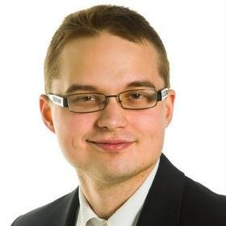

::: {.columns .v-center}

::: {.column width="35%"}
{.img-fluid .rounded}
:::

::: {.column width="65%"}
Olen Kristian Vepsäläinen, kokenut datatieteilijä, joka vaikuttaa tällä hetkellä pääsääntöisesti Pohjois-Savon alueella. 

Jos ihmettelet sloganiani, "Maailma on jakauma", se kuvastaa filosofiaani, jonka mukaan mikä tahansa asia maailmassa on kuvattavissa jollain jakaumalla. Yleensä kuitenkin ihmiset näkevät ilmöistä lähinnä keskiarvoja ja ehkä mediaaneja, mutta vasta jakauma antaa todenmukaisen kuvan siitä, mistä asiassa on oikeasti kyse (ja mistä ei ole). Juuri nämä jakaumat ovat olennaisia todellisuuden ymmärtämisessä. Valitettavasti niitä raportoidaan julkisesti harvoin. Suurin osa maailman avoimesta datasta on piste-estimaatteja, eivät jakaumia. Yksi elämäni missioista on saada tähän muutos ja avoimesta datasta hyödyllisempää jokaiselle.

Olen opiskellut matematiikkaa,tilastotiedettä ja tietojenkäsittelytiedettä Itä-Suomen yliopistossa. Lisäksi minulla on kyberturvallisuusinsinöörin ylempi ammattikorkeakoulututkinto Jyväskylän ammattikorkeakoulusta. Graudni tein liittyen kansantalouden tilinpitoon ja julkaisin siitä [artikkelin](https://arxiv.org/abs/2012.11282).

Työurani olen tehnyt pääasiassa sensitiivisen datan parissa terveydenhuollossa ja finassialalla.

Aloitin työurani jo opiskeluaikana tekemällä matematiikan, fysiikan ja kemian opettajan sijaisuuksia ympäri Itä-Suomea. Tämän jälkeen siirryin Uudellemaalle työskentelemään Sosiaalitaito Oy:llä, jossa tein monipuolista analytiikkaa liittyen Länsi- ja Keski-Uudenmaan sosiaalihuoltoon. Julkaisin tänä aikana myös toisen tieteellisen [artikkelini](https://www.proquest.com/openview/e6cf40d07201be8b1fa8330049145da9/).

Seuraavaksi siirryin Terveyden ja hyvinvoinnin laitokselle eli THL:lle töihin. THL:llä toimin lukuisissa eri projekteissa datatieteilijänä. Projekteista osa oli talon sisäisiä ja osa oli ulkoisten toimijoiden (sekä yksityisiä yrityksiä että muita valtionhallinnon toimoijta) kanssa yhteistyöprojekteja. Näistä projekteista syntyi myös seuraavat tieteelliset artikkelit

- [Predicting utilization of healthcare services from individual disease trajectories using RNNs with multi-headed attention](https://proceedings.mlr.press/v116/kumar20a.html)
- [Assessing health gradient with different equivalence scales for household income – A sensitivity analysis](https://www.sciencedirect.com/science/article/pii/S2352827321001671)
- [Impact of a Conformité Européenne (CE) Certification–Marked Medical Software Sensor on COVID-19 Pandemic Progression Prediction: Register-Based Study Using Machine Learning Methods](https://formative.jmir.org/2022/3/e35181)

sekä konferenssiesitys Assessing the Quality of Finnish Primary Health Care Registers, jonka pidin  konferenssissa 9th Nordic Conference of Epidemiology and Register-Based Health Research Tampereen yliopistolla vuonna 2019.

THL:tä siirryin finanssialalle data-analyytikoksi. Finanssialan kokemukseni liittyy pääasiassa erilaisten compliance-kysymysten analytiikkaan. Samaan aikaan perustin toiminimen, jolla olen tehnyt erilaisia sivuprojekteja.Näistä sivuprojekteista pitkäkestoisin on ollut Tampereen yliopistosairaalan Silmätautikeskuksen kanssa tehdyt projektit, joissa on tehty benchmarking-menetelmä glaukooman hoitoon. Tässä on syntynyt myös kaksi tieteellistä artikkelia:
- [Users of reimbursed glaucoma medications in Finland in 1986–2023: A nationwide study](https://onlinelibrary.wiley.com/doi/10.1111/aos.16803)
- [Prototype master protocol for benchmarking of real-world follow-up data in glaucoma](https://onlinelibrary.wiley.com/doi/full/10.1111/aos.17453)

Olen antanyt myös yksityisopetusta matematiikan ja tilastotieteen aloilla ammattikorkeakoulu- ja yliopisto-opiskeljoille. 

Suoritin tänä aikana myös mainitsemani kyberturvallisuusinsinöörin tutkinnon johon liittyen tein opinnäytetyön, joka liittyi avoimien lähteiden tiedusteluun (OSINT).

Tulevaisuuden tavoitteni on siirtyä täyspäiväiseksi yrittäjäksi data-analytiikan alalla.

Jos sinulla on kiinnostusta projektiin, älä epäröi ottaa yhteyttä kristian.vepsalainen@proton.me